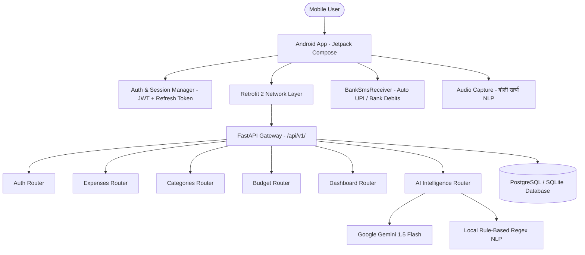
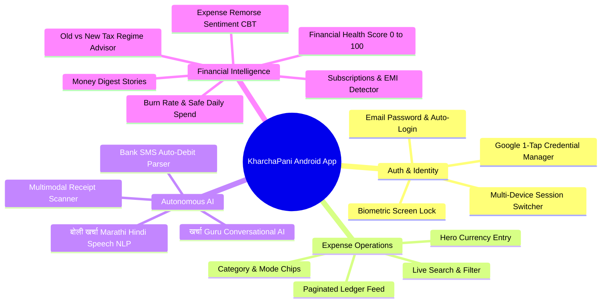
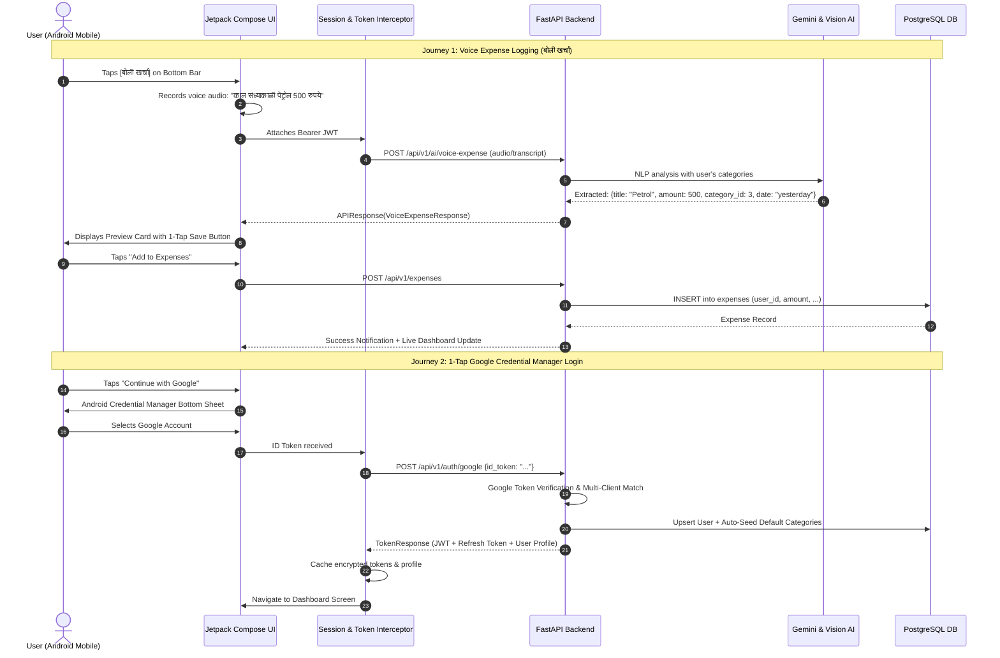

# KharchaPani — Frontend Requirements Specification (FRS) for Android Mobile App

**Document Version:** 1.0  
**Backend API Version:** v3.0 (`/api/v1`)  
**Target Platform:** Native Android (Kotlin + Jetpack Compose) & Next.js 14 Web Equivalence  
**Architecture:** RESTful Async API + Multi-Tenant Data Isolation + Multimodal AI Suite  
**Design System Reference:** [design.md](file:///e:/kharchaPani/design.md) (Obsidian Kinetic)

---

## 1. Executive Summary & System Overview

KharchaPani is an AI-powered financial intelligence platform designed to transform personal expense tracking from a manual chore into an autonomous, conversational, and predictive experience.

The system is built on a high-performance **FastAPI (Python 3.11+)** async backend, **PostgreSQL/SQLite** data layer with zero-trust multi-tenant isolation, and a multimodal **Gemini 1.5 Flash + Local NLP fallback** engine.



---

## 2. Core Entities & Data Dictionary

| Entity | Primary Attributes | Relationships | Constraints & Rules |
| :--- | :--- | :--- | :--- |
| **`User`** | `id` (int, PK)<br>`email` (str, Unique)<br>`hashed_password` (str, nullable)<br>`full_name` (str)<br>`is_active` (bool)<br>`is_verified` (bool)<br>`auth_provider` (str: `local` / `google`)<br>`google_id` (str, nullable)<br>`created_at`, `updated_at` | Has many `Expense`, `Category`, `Budget`, `RefreshToken` | Zero-trust partition key (`user_id`) enforced on all operational queries. |
| **`Category`** | `id` (int, PK)<br>`user_id` (int, FK -> User.id)<br>`name` (str, max 50)<br>`icon` (str, nullable)<br>`color` (str, nullable)<br>`is_default` (bool)<br>`created_at` | Belongs to `User`<br>Has many `Expense` | `(user_id, name)` unique constraint. Default categories seeded automatically upon user creation. |
| **`Expense`** | `id` (int, PK)<br>`user_id` (int, FK -> User.id)<br>`category_id` (int, nullable, FK -> Category.id)<br>`title` / `description` (str)<br>`amount` (Decimal, 10,2)<br>`date` / `expense_date` (Date)<br>`payment_mode` / `payment_method` (str: `UPI`, `Cash`, `Card`, `NetBanking`)<br>`notes` (str, nullable)<br>`created_at`, `updated_at` | Belongs to `User`<br>Belongs to optional `Category` | `amount > 0`. Outer joined with `Category` to prevent deletion loss. |
| **`Budget`** | `id` (int, PK)<br>`user_id` (int, FK -> User.id)<br>`category_id` (int, nullable, FK -> Category.id)<br>`monthly_limit` (Decimal, 10,2)<br>`month` (int, 1-12)<br>`year` (int)<br>`created_at`, `updated_at` | Belongs to `User`<br>Belongs to optional `Category` | If `category_id == null`, represents overall global monthly budget. |
| **`RefreshToken`** | `id` (int, PK)<br>`user_id` (int, FK -> User.id)<br>`token_hash` (str, Unique)<br>`expires_at` (DateTime)<br>`is_revoked` (bool)<br>`device_info` (str, nullable)<br>`ip_address` (str, nullable) | Belongs to `User` | Revocable per-device or globally (`logout-all`). SHA-256 hashed. |
| **`EmailVerificationToken`** | `id` (int, PK)<br>`user_id` (int, FK -> User.id)<br>`token` (str, Unique)<br>`expires_at` (DateTime)<br>`used_at` (DateTime, nullable) | Belongs to `User` | Single-use, valid for 24 hours. |
| **`PasswordResetToken`** | `id` (int, PK)<br>`user_id` (int, FK -> User.id)<br>`token` (str, Unique)<br>`expires_at` (DateTime)<br>`used_at` (DateTime, nullable) | Belongs to `User` | Single-use, valid for 1 hour. |

---

## 3. Authentication & Session Architecture

### A. Token Specifications
- **Access Token:** Short-lived JWT (15 minutes validity). Sent in request header: `Authorization: Bearer <access_token>`.
- **Refresh Token:** Long-lived token (30 days validity). Stored encrypted in Android `EncryptedSharedPreferences` / `SessionManager`. Sent either via `Cookie: kharcha_refresh_token=...` or JSON body payload `{"refresh_token": "..."}`.

### B. Supported Auth Flows
1. **Email & Password Sign-Up:**
   - Registration dispatches `is_verified=False` account and background email token.
   - User receives verification link/token.
2. **Email & Password Login:**
   - Validates credentials and `is_verified` status.
   - Returns Access Token, Refresh Token, and User Profile.
3. **Google One-Tap / Credential Manager (`/auth/google`):**
   - Native Android `GetGoogleIdOption` extracts verified Google ID token.
   - Backend verifies token via Google API, auto-provisions user account if new, seeds default categories, and issues JWT pair.
4. **Silent Token Rotation (`/auth/refresh`):**
   - Triggered on app launch or `401 Unauthorized` interceptor.
   - Invalidates old refresh token and rotates to a fresh pair.
5. **Multi-Device Logout:**
   - Single device logout: `/auth/logout` revokes current refresh token.
   - All devices logout: `/auth/logout-all` revokes all active session hashes.

---

## 4. Complete API Endpoint Matrix

All endpoints reside under prefix `/api/v1` (with `/health` and `/` at root).

### 4.1 Authentication & Profile (`/api/v1/auth`)
| Method | Endpoint | Description | Auth Required | Request Payload | Response Data (`APIResponse[T]`) |
| :--- | :--- | :--- | :--- | :--- | :--- |
| `POST` | `/auth/register` | Register new user | No | `RegisterRequest`: `email`, `password`, `full_name` | `RegisterResponse`: `id`, `email`, `full_name`, `is_verified`, `requires_verification` |
| `POST` | `/auth/login` | Email/Password login | No | `LoginRequest`: `email`, `password` | `TokenResponse`: `access_token`, `expires_in`, `refresh_token`, `user` |
| `POST` | `/auth/google` | Google OAuth / ID Token | No | `GoogleAuthRequest`: `id_token` | `TokenResponse`: `access_token`, `expires_in`, `refresh_token`, `user` |
| `POST` | `/auth/refresh` | Rotate session tokens | No (Token in body or cookie) | `RefreshTokenRequest`: `refresh_token` (optional) | `RefreshTokenResponse`: `access_token`, `expires_in`, `refresh_token` |
| `POST` | `/auth/logout` | Revoke current device | No / Optional | `RefreshTokenRequest`: `refresh_token` (optional) | `{"logged_out": true}` |
| `POST` | `/auth/logout-all` | Revoke all user sessions | **Yes** (Bearer JWT) | None | `{"logged_out_all": true}` |
| `GET` | `/auth/me` | Fetch authenticated user | **Yes** (Bearer JWT) | None | `UserResponse`: `id`, `email`, `full_name`, `is_active`, `is_verified`, `auth_provider`, `created_at` |
| `POST` | `/auth/verify-email` | Verify email (JSON body) | No | `VerifyEmailRequest`: `token` | `{"verified": true, "email": "..."}` |
| `GET` | `/auth/verify-email` | Verify email (URL Query) | No | Query: `token` | `{"verified": true, "email": "..."}` |
| `POST` | `/auth/resend-verification`| Resend verify email | No | `ResendVerificationRequest`: `email` | `{"sent": true}` |
| `POST` | `/auth/forgot-password` | Request password reset | No | `ForgotPasswordRequest`: `email` | `{"sent": true}` |
| `POST` | `/auth/reset-password` | Reset password via token | No | `ResetPasswordRequest`: `token`, `new_password` | `{"reset": true}` |
| `POST` | `/auth/change-password`| Change password | **Yes** (Bearer JWT) | `ChangePasswordRequest`: `current_password`, `new_password` | `{"changed": true}` |

---

### 4.2 Expense Management (`/api/v1/expenses`)
| Method | Endpoint | Query Parameters | Request Payload | Response Data |
| :--- | :--- | :--- | :--- | :--- |
| `GET` | `/expenses` | `page` (int=1), `page_size` (int=20), `category_id` (int), `search` (str), `start_date` (YYYY-MM-DD), `end_date` (YYYY-MM-DD), `min_amount` (num), `max_amount` (num), `payment_mode` (str), `sort_by` (`date`\|`amount`\|`category`\|`title`), `order` (`asc`\|`desc`) | None | `PaginatedData[ExpenseResponse]`: `items`, `total`, `page`, `page_size`, `total_pages` |
| `POST` | `/expenses` | None | `ExpenseCreate`: `title`, `amount`, `category_id`, `date`, `payment_mode`, `notes` | `ExpenseResponse`: `id`, `user_id`, `category_id`, `category_name`, `category_icon`, `category_color`, `title`, `amount`, `date`, `payment_mode`, `notes`, `created_at` |
| `PUT` | `/expenses/{id}` | None | `ExpenseUpdate`: `title`, `amount`, `category_id`, `date`, `payment_mode`, `notes` (all optional) | `ExpenseResponse` |
| `DELETE` | `/expenses/{id}` | None | None | `{"deleted": true, "id": id}` |

---

### 4.3 Category Management (`/api/v1/categories`)
| Method | Endpoint | Query Parameters | Request Payload | Response Data |
| :--- | :--- | :--- | :--- | :--- |
| `GET` | `/categories` | None | None | `List[CategoryResponse]`: `id`, `user_id`, `name`, `icon`, `color`, `is_default`, `created_at` |
| `POST` | `/categories` | None | `CategoryCreate`: `name`, `icon`, `color` | `CategoryResponse` |
| `PUT` | `/categories/{id}` | None | `CategoryUpdate`: `name`, `icon`, `color` | `CategoryResponse` |
| `DELETE` | `/categories/{id}` | `reassign_to` (int, optional), `cascade` (bool=false) | None | `{"deleted": true, "id": id, "reassigned_to": ..., "expenses_updated": ...}` |

---

### 4.4 Budgeting & Alert Limits (`/api/v1/budget`)
| Method | Endpoint | Query Parameters | Request Payload | Response Data |
| :--- | :--- | :--- | :--- | :--- |
| `GET` | `/budget` | None | None | `List[BudgetResponse]`: `id`, `user_id`, `category_id`, `monthly_limit`, `month`, `year` |
| `POST` | `/budget` | None | `BudgetCreate`: `category_id` (null for overall), `monthly_limit`, `month`, `year` | `BudgetResponse` |
| `GET` | `/budget/status` | `category_id` (int, optional) | None | `BudgetStatusResponse`: `total_budget`, `total_spent`, `remaining_budget`, `percentage_used`, `is_exceeded`, `period` |

---

### 4.5 Financial Dashboard & Aggregate Metrics (`/api/v1/dashboard`)
| Method | Endpoint | Query Parameters | Response Data Structure |
| :--- | :--- | :--- | :--- |
| `GET` | `/dashboard/summary` | `period` (`day`\|`week`\|`month`=default) | `DashboardSummaryResponse`: `total_spent`, `expense_count`, `recent_expenses`, `budget_status` |
| `GET` | `/dashboard/charts` | `period` (`day`\|`week`\|`month`=default) | `DashboardChartsResponse`: `pie_chart` (categories with % & total), `trend_chart` (dates with spend amount) |
| `GET` | `/dashboard/comparison` | None | `MonthComparisonResponse`: `current_month_total`, `previous_month_total`, `percentage_change`, `is_increase` |
| `GET` | `/dashboard/top-categories`| `period` (str), `limit` (int, 1-10) | `List[TopCategoryResponse]`: `category_id`, `category_name`, `category_icon`, `total_amount`, `percentage` |
| `GET` | `/dashboard/average-spend` | `period` (str) | `AverageSpendResponse`: `daily_average`, `weekly_average`, `period`, `days_counted` |

---

### 4.6 AI Financial Intelligence Suite (`/api/v1/ai`)
| Method | Endpoint | Type | Input / Payload | Output Model & Purpose |
| :--- | :--- | :--- | :--- | :--- |
| `POST` | `/ai/quick-parse` | JSON | `AIQuickParseRequest`: `text`, `reference_date` | `AIQuickParseResponse`: `title`, `amount`, `category_id`, `category_name`, `date`, `payment_mode`, `confidence`, `engine_used` (`gemini`\|`local`) |
| `POST` | `/ai/voice-expense` / `/ai/voice-parse` | Multipart / JSON | `file` (audio webm/wav/m4a) OR `transcript` (str), `language` (`auto`\|`mr`\|`hi`\|`en`) | `VoiceExpenseResponse`: `detected_language`, `transcript`, `title`, `amount`, `category_id`, `category_name`, `date`, `payment_mode` |
| `POST` | `/ai/receipt-scan` | Multipart File | `file` (JPG/PNG/WebP/PDF max 10MB) | `ReceiptScanResponse`: `merchant_name`, `total_amount`, `tax_amount`, `invoice_date`, `suggested_category_id`, `line_items` |
| `POST` | `/ai/chat` | JSON | `AIChatRequest`: `message`, `history` (`role`, `content`) | `AIChatResponse`: `reply`, `suggested_actions`, `timestamp` (**Kharcha Guru AI Chatbot**) |
| `GET` | `/ai/recommendations` | Query / Get | None | `AIRecommendationsResponse`: `health_score` (0-100), `score_grade`, `summary`, `actionable_recommendations`, `spending_velocity` |
| `GET` | `/ai/subscriptions` | Query / Get | None | `SubscriptionsResponse`: `subscriptions` (`name`, `amount`, `frequency`, `last_billed`, `confidence`), `total_monthly_recurring` |
| `POST` | `/ai/savings-goal` | JSON | `SavingsGoalRequest`: `target_amount`, `target_date`, `goal_name` | `SavingsGoalResponse`: `monthly_savings_needed`, `feasibility_score`, `suggested_cuts` (category reductions), `timeline_months` |
| `POST` / `GET` | `/ai/cashflow-forecast`| JSON / Get | `CashFlowForecastRequest`: `expected_monthly_income`, `forecast_months` | `CashFlowForecastResponse`: `projected_runway_days`, `safe_daily_spend`, `zero_balance_date`, `month_by_month_projection` |
| `POST` | `/ai/tax-advisor` | JSON | `TaxAdvisorRequest`: `annual_income`, `declared_investments` | `TaxAdvisorResponse`: `recommended_regime` (`old`\|`new`), `old_regime_tax`, `new_regime_tax`, `tax_saved`, `deductions_detected` (80C, 80D, HRA) |
| `GET` | `/ai/money-digest` | Query: `month`, `year` | None | `MoneyDigestResponse`: **Spotify-Wrapped Style Stories** (`top_spending_day`, `biggest_expense`, `favorite_merchant`, `vibe_title`, `badge`) |
| `POST` / `GET` | `/ai/financial-health` | JSON / Get | `FinancialHealthRequest`: `monthly_income` | `FinancialHealthResponse`: `score` (0-100), `grade`, `emergency_fund_months`, `fifty_thirty_twenty_rule` (`needs`, `wants`, `savings`), `pillar_scores` |
| `POST` / `GET` | `/ai/budget-forecast` | JSON / Get | `BudgetForecastRequest` | `BudgetForecastResponse`: `projected_month_end_spend`, `burn_rate_velocity`, `exhaustion_date`, `category_risks` |
| `POST` / `GET` | `/ai/expense-sentiment` | JSON / Query: `days` | None | `ExpenseSentimentResponse`: `dominant_emotion` (`Joyful`, `Impulsive`, `Stress`, `Peaceful`), `remorse_risk_percentage`, `cbt_insights` |

---

## 5. Functional Requirements for Android Mobile App



### Module 1: Authentication & Onboarding
- **FR-01 (1-Tap Google Login):** Must invoke native `CredentialManager` / `GetGoogleIdOption`. If credential not available on device, gracefully fall back to legacy Google Sign-In intent.
- **FR-02 (Zero-Latency Hydration):** On app startup, read cached `kharcha_user` from `EncryptedSharedPreferences`. Render Dashboard immediately without showing a blank screen.
- **FR-03 (Biometric Guard):** Optional app lock with `BiometricPrompt` on app resume.
- **FR-04 (Backend Dynamic Switcher):** In Settings, provide instant 1-tap switching between **Cloud Production API** (`Render`) and **Local Wi-Fi Development IP** (`http://192.168.x.x:8000/api/v1/`).

### Module 2: Dashboard & Real-Time Financial Telemetry
- **FR-05 (Timeframe Switcher):** Segmented pill controls for `Today`, `This Week`, and `This Month`.
- **FR-06 (Hero Balance Card):** Obsidian frosted glass card displaying total spend with tabular numbers, live badge, and MoM trend percentage indicator.
- **FR-07 (Live Budget Meter):** Visual progress bar tracking spend against limit. Transitions to `CoralRose` alert when exceeded.
- **FR-08 (Quick Action Triggers):** Direct access to `+ Add Expense` and `बोली खर्चा` (Voice AI).

### Module 3: Expense Creation, Ledger & Search
- **FR-09 (Fast Manual Entry):** Modal bottom sheet with large hero monetary field, auto-focus, category horizontal chips, payment mode chips (`UPI`, `Cash`, `Card`, `NetBanking`), and optional notes.
- **FR-10 (Auto-Categorization):** Instant local keyword detector mapping text like "swiggy" -> Food, "uber" -> Travel, "petrol" -> Fuel, "dmart" -> Groceries.
- **FR-11 (Search & Filter Ledger):** Search by vendor, title, or note; filter by category chip; delete with confirmation dialog.

### Module 4: Multilingual Voice Expense Engine ("बोली खर्चा")
- **FR-12 (Voice Recording & Audio Upload):** Built-in audio recorder capturing speech in Marathi, Hindi, or English.
- **FR-13 (Voice NLP Parsing):** Submits audio or speech transcript to `/ai/voice-expense`. Renders a preview card displaying parsed title, amount, category, and date for 1-tap confirmation.
- **FR-14 (Natural Language Text Parser):** Allows typing single strings like *"dostansobat dinner 850 rupaye"* to instantly resolve into structured expense entries.

### Module 5: Multimodal Receipt OCR Scanner
- **FR-15 (Camera & Gallery Capture):** User captures receipt or selects image/PDF invoice.
- **FR-16 (Vision AI Processing):** Calls `/ai/receipt-scan` using Gemini Multimodal Vision to extract vendor name, total amount, taxes, date, and mapped category.

### Module 6: Autonomous Bank & UPI SMS Reader
- **FR-17 (Broadcast Receiver):** Android `BankSmsReceiver` listens for `SMS_RECEIVED`.
- **FR-18 (Debit Detection):** Regex parser detects debits from Indian banks and UPI handles (HDFC, SBI, ICICI, Axis, Kotak, GPay, PhonePe, Paytm).
- **FR-19 (Notification Nudge):** Prompts user with an actionable notification: *"Spent ₹450 at Starbucks? Tap to save in 1-click."*

### Module 7: AI Financial Health & Analytics Suite
- **FR-20 (Financial Health Score 0-100):** Visual circular score meter evaluating savings ratio, runway, and 50/30/20 budget adherence.
- **FR-21 (Burn Rate & Safe Daily Limit):** Displays live daily spending velocity and calculated safe daily spending target.
- **FR-22 (Expense Sentiment & CBT):** Analyzes emotional buying patterns (e.g. stress eating vs planned investments) and remorse risk.
- **FR-23 (Subscriptions & EMI Tracker):** Lists detected recurring subscriptions (Netflix, Spotify, Gym, Rent, EMIs) with renewal timeline.
- **FR-24 (Tax Regime Advisor):** Compares Old vs New Tax Regime deductions based on recorded Section 80C, 80D, and HRA expenses.
- **FR-25 (Savings Goal Simulator):** Calculates monthly savings target and highlights discretionary categories to trim.
- **FR-26 (Monthly Money Digest):** Interactive story cards (Instagram-style) summarizing monthly records.

### Module 8: खर्चा Guru AI Conversational Coach
- **FR-27 (Interactive Chat UI):** Conversational messaging with Kharcha Guru.
- **FR-28 (Context-Aware Insights):** Guru answers questions with live access to the user's spending data and categories.
- **FR-29 (Quick-Prompt Chips):** Pre-built prompt chips like *"Am I on track this month?"*, *"How much did I spend on food?"*, *"Where can I save ₹2,000?"*.

---

## 6. End-to-End User Journeys



---

## 7. Mobile UI Design Rules & Screen Architecture

All UI components must strictly adhere to the design system established in [design.md](file:///e:/kharchaPani/design.md):

```
📱 Mobile Viewport Frame (Max width 430px)
├── 🔝 Top Bar: User Avatar Badge + Greeting + Settings Icon
├── 🔘 Segmented Timeframe Control: [Today] [This Week] [This Month] (Pill Tray)
├── 💳 Obsidian Hero Card: Total Spent (₹) + Live Glow + MoM Trend Badge
├── 📊 Monthly Budget Card: Progress Bar (Emerald -> Coral Rose)
├── ⚡ Quick Actions: [+ Add Expense (Gradient Pill)] [बोली खर्चा (Frosted Glass)]
├── 🤖 खर्चा Guru AI Floating Banner
└── 📜 Recent Transactions Ledger: Category Icon Badges + Tabular Numbers
└── 🔽 Bottom Glassmorphic Navigation Bar: [Home] [Expenses] [🎙️ बोली] [🤖 Guru] [Analytics]
```

### UI Style Tokens Quick Reference
- **Theme Canvas:** Midnight Obsidian `#0B0F19` (`ObsidianCanvas`).
- **Cards & Modals:** Frosted Glass `#111827` (`SurfaceElevated`) + `BorderGlass` (`0x14FFFFFF`) 1px outline.
- **Brand Primary:** Neon Indigo `#6366F1` (`#C0C1FF` surface tint).
- **Income / Positive Signals:** Electric Emerald `#10B981` (`#4EDEA3`).
- **Expense / Alert Outflows:** Coral Rose `#F43F5E` (`#FFB4AB`).
- **AI Intelligence:** Vibrant Violet `#8B5CF6` (`#D0BCFF`).
- **Pill Geometry:** Buttons, chips, and segment indicators use `RoundedCornerShape(percent = 50)` (`rounded-full`). Cards use `20.dp` to `24.dp` (`rounded-lg`).
- **Typography:** `Plus Jakarta Sans` for headers and currency figures; `Manrope` for body and lists; `tabular-nums` enforced on all numbers.

---

## 8. Non-Functional, Security & Performance Requirements

1. **Zero-Trust Multi-Tenancy:** The mobile app must never send raw SQL queries or user IDs in body filters. All backend queries derive `user_id` strictly from the decoded cryptographic JWT claims.
2. **Network Resilience & Error Parsing:** The Android network layer (`NetworkErrorParser.kt`) must parse exact FastAPI JSON error structures (`{"detail": "..."}`) rather than generic HTTP status codes.
3. **Offline Fallback Engine:**
   - When offline or when Gemini API limits are reached, the system must seamlessly fall back to the built-in regex-based Local NLP parser (`local_provider.py`).
4. **Performance SLAs:**
   - Instant app hydration: `< 100ms` using encrypted cached user state.
   - API response time: `< 300ms` for dashboard and ledger queries.
   - Voice and Vision AI parse time: `< 1.8s` round-trip.
5. **Security & Storage:**
   - Tokens stored exclusively in Android `MasterKey` encrypted `EncryptedSharedPreferences`.
   - Cleartext HTTP traffic blocked in release builds (allowed only for private LAN subnets `192.168.*`, `10.*` in debug builds).
